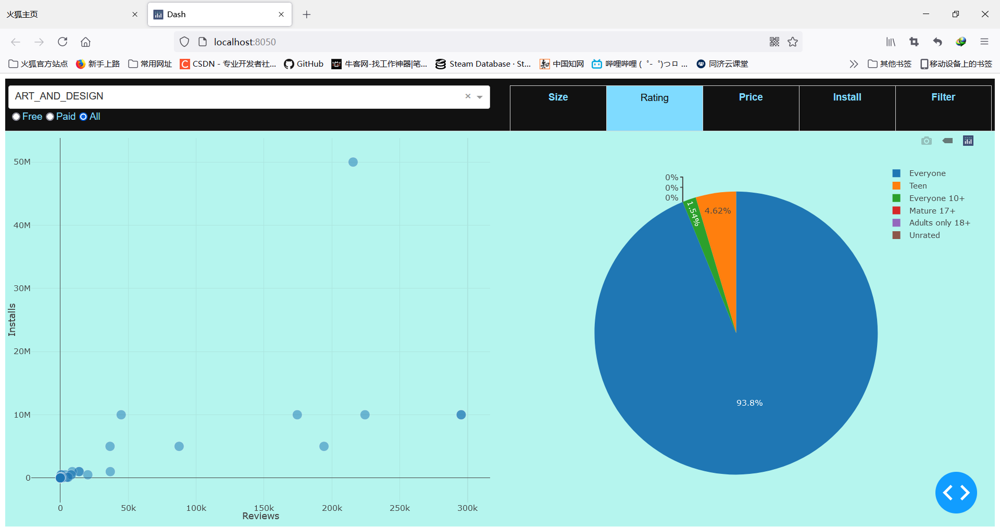

# Data Visualization

1852141 Li Detao

Human-Computer Interaction Assignment 3, 2021 Spring

Github: https://github.com/needle1989/Data-Visualization

[TOC]

## Environment

* How to install?

  Unzip source code and run app.py. Make sure you have followed instructions below.

* Necessary Packages:

   Python (64bit)

   dash

   plotly

   dash-daq

   pandas

   csv

* The program is developed by PyCharm using html and python.

## Data Analysis Task 

Google Play Store Apps is chosen to be my dataset for analysis. Each app (row) has values for category, rating, size, and more.

What is the overall app ratings, and is there any relationship between downloads and user ratings? What is the charging status of the application, and is the price of the application related to the number of downloads? Which application category has the most downloads? 

My data analysis task is to answer the questions above.

## Layout of Designed Dashboard 

In this section I will show my design for data visualization dashboard.

Dashboard layout can be seen as:

* Size:

  

* Rating:

  

* Price

  

* Install

  

* Filter

  

## Patterns Revealed in the Figures

- Application scores often reflect the quality of applications. The application scores in this data set are mainly concentrated between 4-5 points, accounting for 78.11%, followed by 3-4 points, accounting for 18.73%, indicating that Google applications Most of the stores are high-quality apps. The higher the app’s score, the higher the download volume. Among them, the average download volume of apps with a score of 4-5 is as high as 20 million, which is 4 times higher than the average download volume of apps with a score of 3-4. 
- There are 33 application categories, the first three categories are family, games, and tools. The top 3 average downloads are communication chat, community, and video player, indicating that social networking, video, etc. are generally favored by the public. 
- 79.8% of the apps in the Google Play Store are suitable for everyone, and 11.5% of the apps are suitable for teenagers. For applications that are suitable for everyone, communication and chat applications are the mainstream applications, with an average download volume of about 80 million, followed by creative applications, with an average download volume of close to 38 million, and game applications at 34 million. . For applications suitable for teenagers, the main categories are video players, news and magazines, and communities (social), indicating that teenagers do not forget to pay attention to current affairs when they are leisure and entertainment. 

## Function Implementation

* Data collection for main graph

  ```python
  return {
          'data': [
              go.Scatter(
                  x=Reviews,  
                  y=Installs,  
                  text=App, 
                  mode='markers',
                  marker={
                      'size': 15,
                      'opacity': 0.5,
                      'line': {
                          'width': 0.5,
                          'color': 'white'
                      }
                  })],
          'layout':
              go.Layout(
                  paper_bgcolor='#b5f5ee',
                  plot_bgcolor='#b5f5ee',
                  xaxis={
                      'title': 'Reviews',
                  },
                  yaxis={
                      'title': 'Installs',
                  },
                  margin={
                      'l': 40,
                      'b': 30,
                      't': 10,
                      'r': 0
                  },
                  height=600,
                  hovermode='closest')
      }
  ```

* Callback for graph

  ```python
  @app.callback(
      dash.dependencies.Output('size-graph', 'figure'),  
      [
          dash.dependencies.Input('category', 'value'),  
          dash.dependencies.Input('price', 'value')  
      ])
  ```
  
  


## Possible Improvement

* The application can be upgraded by improving visual effects.
